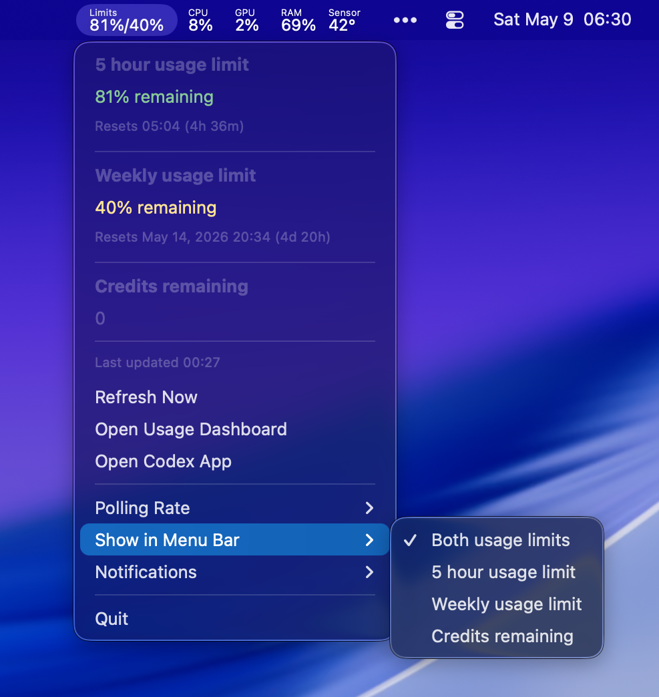

# CodexMeter

CodexMeter is a small macOS menu bar app for keeping an eye on Codex usage limits.

It reads the local Codex auth session, fetches the Codex usage endpoint, and shows the current 5 hour and weekly
remaining limits in the menu bar. The menu also includes reset times, credits remaining, polling controls, notification
settings, and shortcuts to Codex and the usage dashboard.

## Requirements

- macOS 15.7 or newer
- Codex installed and signed in locally

CodexMeter reads the Codex auth file from `~/.codex/auth.json`. It does not ask for or store your password.

## Installation

You can either [download the binary](https://github.com/Qrivi/CodexMeter/releases) or install it via Homebrew:

```sh
brew tap qrivi/tap
brew install --cask qrivi/tap/codexmeter
```

## Development

Open `CodexMeter.xcodeproj` in Xcode and run the `CodexMeter` scheme.

From the command line, when Xcode is selected as the active developer directory:

```sh
xcodebuild -project CodexMeter.xcodeproj -scheme CodexMeter test
```
