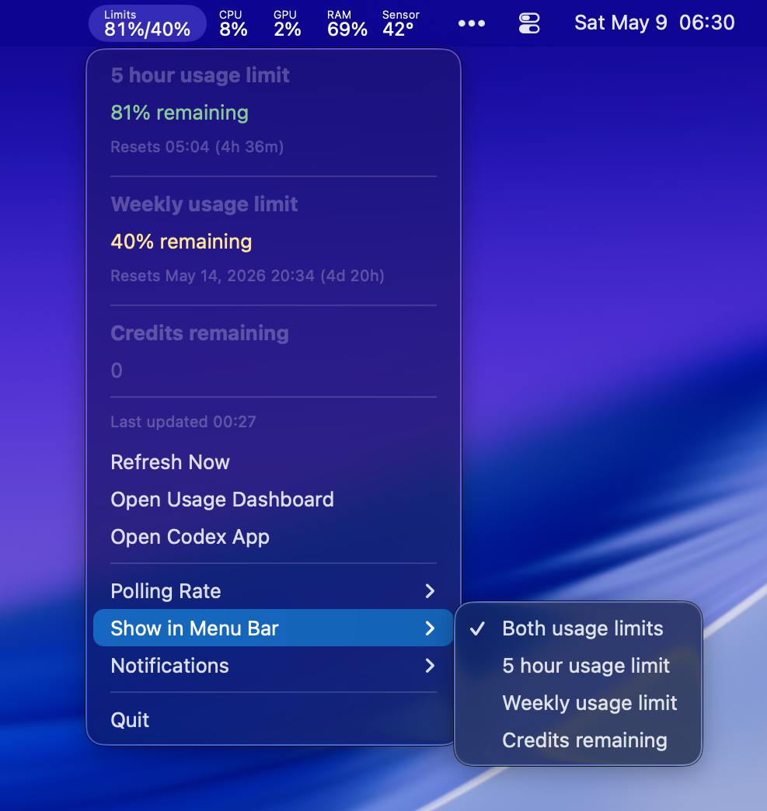

# CodexMeter

CodexMeter is a macOS menu bar companion for keeping Codex usage visible at all times.

It reads your local Codex auth session, fetches the Codex usage endpoint, and shows every usage limit returned for your
plan, including additional model-specific limits, reset times, credits, and available usage limit resets. The menu bar label can show either a main
usage window, both main windows, any additional meter, or credits, with configurable monochrome and warning color modes.

The menu includes quick refresh, shortcuts to Codex and the usage dashboard, stale/error status, and a settings window
for polling, launch at login, menu-open refreshes, appearance, and meters. Each available meter can be shown or hidden
and has independent notification settings: low usage and plan resets, low credits and credit additions, or usage limit
reset count decreases and additions. Credit and reset count notifications include the remaining total.

## Requirements

- macOS 15.7 or newer
- Codex installed and signed in locally

CodexMeter reads the Codex auth file from `~/.codex/auth.json`. It does not ask for or store your password.

## Installation

You can either [download the binary](https://github.com/Qrivi/CodexMeter/releases) or install it via Homebrew:

```sh
brew tap qrivi/tap
brew install --cask qrivi/tap/codexmeter
```

## Development

Open `CodexMeter.xcodeproj` in Xcode and run the `CodexMeter` scheme.

From the command line, when Xcode is selected as the active developer directory:

```sh
xcodebuild -project CodexMeter.xcodeproj -scheme CodexMeter test
```
